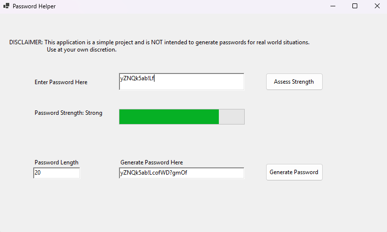

# Password Helper
## DISCLAIMER
This application is for educational use only and should NOT be used for securing sensitive information.

## Description
Password Helper is a small application that can assess the strength of a given password! It can also generate passwords of a custom length with random letters (upper and lowercase), numbers, and symbols ("!" and "?"). 

## Installation
To run this program select the v1.0 release and install the "PasswordHelper.zip" folder. Unzip this folder and run the "PasswordHelper.exe" file. 

## Usage
The Password Helper can be used to get a general idea of what a strong password looks like both by rating custom passwords and generating random passwords. Do NOT use this application or its output to secure sensitive information. 

## Credits
This application was made solely by me, [Benjamin Sidwell](https://github.com/bensidwell).

The GUI for this project was made in C# using [WinForms](https://learn.microsoft.com/en-us/visualstudio/ide/create-csharp-winform-visual-studio?view=vs-2022).
